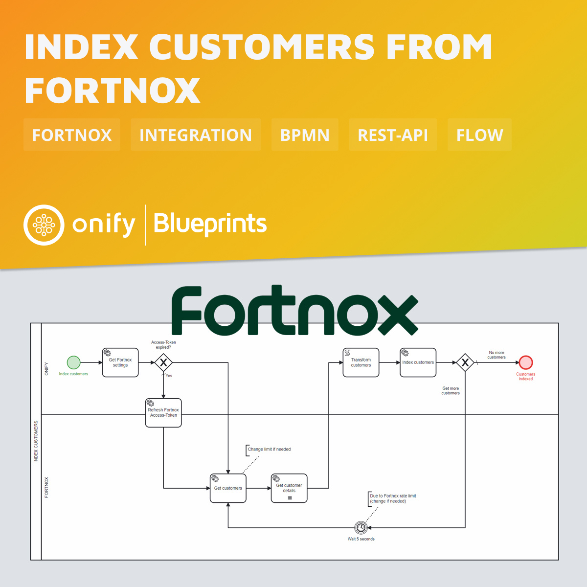

# Onify Blueprint: Index customers from Fortnox

[Fortnox](https://fortnox.com/) is a Swedish ERP company that delivers a cloud-based business platform for financial management. 

In this Blueprint we index customers (including details) from Fortnox via REST-API.

## Requirements

* [Onify Hub](https://github.com/onify/install)
* [Fortnox](https://freshservice.com/)

## Included

* 1 x Flows

## Setup

This Blueprint requires [Onify Blueprint: Activate and authenticate Fortnox integration](https://github.com/onify/blueprint-fortnox-activate-authenticate). Please deploy/setup that first.

## Test

1. Open the BPMN diagram in Camunda Modeler.
2. Deploy the BPMN diagram (click `Deploy current diagram` and follow the steps).
3. Run it (click `Start current diagram`).

> Note: Fortnox API has [rate limits](https://developer.fortnox.se/general/regarding-fortnox-api-rate-limits/) that you need to be aware of. You might need to adjust the `query.limit` variable in *Get Customers* task and also the wait task (currently 5 seconds).

## Support

* Community/forum: https://support.onify.co/discuss
* Documentation: https://support.onify.co/docs
* Support and SLA: https://support.onify.co/docs/get-support

## License

This project is licensed under the MIT License - see the [LICENSE](LICENSE) file for details.